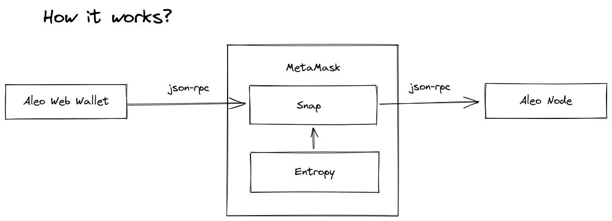

# Aleo Web Wallet Snap

## How it works

## Demo

[Aleo Web Wallet Snap](https://aleo-snap.netlify.app/)

### Demo Instructions

In order to run this demo, we need to install a modified snap version:

- The newest [MetaMask extension](https://github.com/MetaMask/metamask-extension) that support MetaMask Flask: Checkout the newest flask version using tags that match `v*.*.*-flask`, for example `v10.14.0-flask`
- Build the extension locally: `yarn setup && yarn dist --build-type flask`
- Load the unpacked extension (see "custom build" instructions) from [here](https://github.com/MetaMask/metamask-extension/tree/eth-denver-2022#other-docs)
